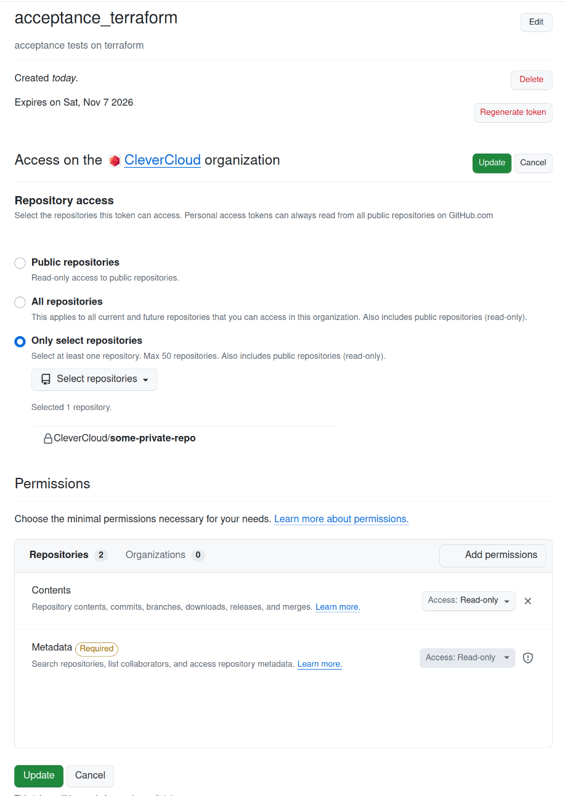

---
# generated by https://github.com/hashicorp/terraform-plugin-docs
page_title: "clevercloud Provider"
description: |-
  CleverCloud provider allow you to interact with CleverCloud platform.
  Authentication
  The provider supports two authentication modes, mutually exclusive:
  OAuth1 (default): the credentials created by clever login, used against https://api.clever-cloud.com. They can be provided through the token/secret parameters, through environment variables, or read from the clever-tools configuration file.API token (Bearer): an API token created with clever tokens create, sent as a Bearer token to the API bridge (https://api-bridge.clever-cloud.com). It can be provided through the api_token parameter or the CLEVER_API_TOKEN environment variable.
  Configuring both modes at the same time is an error. Explicit provider parameters always take precedence over environment variables.
  | Environment variable | Mode | Description |
  |---|---|---|
  | `CLEVER_API_TOKEN` | API token | API token sent as a Bearer token to the API bridge |
  | `CC_OAUTH_TOKEN` | OAuth1 | OAuth1 user token |
  | `CC_OAUTH_SECRET` | OAuth1 | OAuth1 user secret |
  | `CC_CONSUMER_KEY` | OAuth1 | Dedicated OAuth1 consumer key (optional) |
  | `CC_CONSUMER_SECRET` | OAuth1 | Dedicated OAuth1 consumer secret (optional) |
  | `CC_ORGANISATION` | both | Organisation identifier (`orga_xxx` or `user_xxx`) |
  
  provider "clevercloud" {
    organisation = "orga_xxx"
    api_token    = var.clever_api_token
  }
  
  Note: API tokens cannot sign git operations. Application resources deploying code over git still require OAuth1 credentials.
  Dedicated OAuth consumer
  If you want to use a dedicated OAuth consumer and the acording user tokens,
  be sure the next rights are granted
  
  # EN
  Access my personal information
  Access my organizations
  Manage my organizations
  Manage my organizations's applications
  Manage my organizations's add-ons
  
  # FR
  Accéder à mes informations personnelles
  Accéder à mes organisations
  Gérer mes organisations
  Gérer les applications de mes organisations
  Gérer les add-ons de mes organisations
  
  Applications: private repository deployment
  To deploy from a private GitHub repository, you need to generate a Personal Access Token (PAT) that will be used for authentication.
  Creating a GitHub Personal Access Token
  Navigate to GitHub Settings → Developer settings → Personal access tokens https://github.com/settings/tokensCreate a fine-grained token https://github.com/settings/personal-access-tokens/new with read access to repository contentsBest practice: Limit the token to only the specific repositories you want to deploy (use "Only select repositories" instead of "All repositories")
  
  For detailed instructions, refer to GitHub's documentation on creating a fine-grained personal access token https://docs.github.com/en/authentication/keeping-your-account-and-data-secure/managing-your-personal-access-tokens#creating-a-fine-grained-personal-access-token
  Using the Token in Terraform
  Once the token is generated, add the authentication_basic attribute to the deployment block of your application resource:
  
  resource "clevercloud_nodejs" "my_app" {
    # ... other configuration ...
  
    deployment {
      repository = "https://github.com/OWNER/REPO.git"
      authentication_basic = "USER:PAT_TOKEN"
    }
  }
  
  Where:
  USER is the GitHub username of the person who created the tokenPAT_TOKEN is the Personal Access Token generated in the previous step
---

# clevercloud Provider

CleverCloud provider allow you to interact with CleverCloud platform.

## Authentication

The provider supports two authentication modes, mutually exclusive:

- **OAuth1 (default)**: the credentials created by `clever login`, used against https://api.clever-cloud.com. They can be provided through the `token`/`secret` parameters, through environment variables, or read from the clever-tools configuration file.
- **API token (Bearer)**: an API token created with `clever tokens create`, sent as a Bearer token to the API bridge (https://api-bridge.clever-cloud.com). It can be provided through the `api_token` parameter or the `CLEVER_API_TOKEN` environment variable.

Configuring both modes at the same time is an error. Explicit provider parameters always take precedence over environment variables.

| Environment variable | Mode | Description |
|---|---|---|
| `CLEVER_API_TOKEN` | API token | API token sent as a Bearer token to the API bridge |
| `CC_OAUTH_TOKEN` | OAuth1 | OAuth1 user token |
| `CC_OAUTH_SECRET` | OAuth1 | OAuth1 user secret |
| `CC_CONSUMER_KEY` | OAuth1 | Dedicated OAuth1 consumer key (optional) |
| `CC_CONSUMER_SECRET` | OAuth1 | Dedicated OAuth1 consumer secret (optional) |
| `CC_ORGANISATION` | both | Organisation identifier (`orga_xxx` or `user_xxx`) |

```hcl
provider "clevercloud" {
  organisation = "orga_xxx"
  api_token    = var.clever_api_token
}
```

Note: API tokens cannot sign git operations. Application resources deploying code over git still require OAuth1 credentials.

## Dedicated OAuth consumer

If you want to use a dedicated OAuth consumer and the acording user tokens, 
be sure the next rights are granted

```
# EN
Access my personal information
Access my organizations
Manage my organizations
Manage my organizations's applications
Manage my organizations's add-ons

# FR
Accéder à mes informations personnelles
Accéder à mes organisations
Gérer mes organisations
Gérer les applications de mes organisations
Gérer les add-ons de mes organisations
```

## Applications: private repository deployment

To deploy from a private GitHub repository, you need to generate a Personal Access Token (PAT) that will be used for authentication.

### Creating a GitHub Personal Access Token

1. Navigate to GitHub Settings → Developer settings → [Personal access tokens](https://github.com/settings/tokens)
2. [Create a fine-grained token](https://github.com/settings/personal-access-tokens/new) with read access to repository contents
3. **Best practice**: Limit the token to only the specific repositories you want to deploy (use "Only select repositories" instead of "All repositories")



For detailed instructions, refer to [GitHub's documentation on creating a fine-grained personal access token](https://docs.github.com/en/authentication/keeping-your-account-and-data-secure/managing-your-personal-access-tokens#creating-a-fine-grained-personal-access-token)

### Using the Token in Terraform

Once the token is generated, add the `authentication_basic` attribute to the `deployment` block of your application resource:

```hcl
resource "clevercloud_nodejs" "my_app" {
  # ... other configuration ...

  deployment {
    repository = "https://github.com/OWNER/REPO.git"
    authentication_basic = "USER:PAT_TOKEN"
  }
}
```

Where:
- `USER` is the GitHub username of the person who created the token
- `PAT_TOKEN` is the Personal Access Token generated in the previous step


<!-- schema generated by tfplugindocs -->
## Schema

### Optional

- `api_token` (String, Sensitive) Clever Cloud API token, sent as a Bearer token to the API bridge (https://api-bridge.clever-cloud.com). Mutually exclusive with the OAuth1 parameters (token, secret, consumer_key, consumer_secret). This parameter can also be provided via the CLEVER_API_TOKEN environment variable. Note: API tokens cannot sign git operations, so application resources deploying code over git still require OAuth1 credentials.
- `consumer_key` (String) Clever Cloud OAuth1 consumer key. Allows using a dedicated OAuth consumer.
- `consumer_secret` (String, Sensitive) CleverCloud OAuth1 consumer secret. Allows using a dedicated OAuth consumer.
- `disable_networkgroups` (Boolean) Disable netorkgroups features
- `endpoint` (String) Clever Cloud API endpoint, default to https://api.clever-cloud.com
- `organisation` (String, Sensitive) Clever Cloud organisation, can be either orga_xxx, or user_xxx for personal spaces. This parameter can also be provided via CC_ORGANISATION environment variable.
- `secret` (String, Sensitive) Clever Cloud OAuth1 secret, can be took from clever-tools after login. This parameter can also be provided via CC_OAUTH_SECRET environment variable.
- `token` (String, Sensitive) Clever Cloud OAuth1 token, can be took from clever-tools after login. This parameter can also be provided via CC_OAUTH_TOKEN environment variable.
