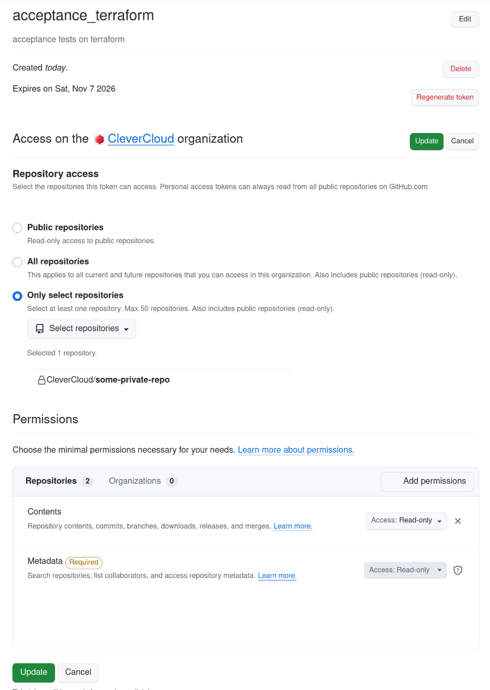

---
# generated by https://github.com/hashicorp/terraform-plugin-docs
page_title: "clevercloud Provider"
description: |-
  CleverCloud provider allow you to interact with CleverCloud platform.
  Authentication
  The provider supports two authentication modes, mutually exclusive:
  OAuth1 (default): the credentials created by clever login, used against https://api.clever-cloud.com. They can be provided through the token/secret parameters, through environment variables, or read from the clever-tools configuration file.API token (Bearer): an API token created with clever tokens create, sent as a Bearer token to the API bridge (https://api-bridge.clever-cloud.com). It can be provided through the api_token parameter or the CLEVER_API_TOKEN environment variable.
  Configuring both modes at the same time is an error. Explicit provider parameters always take precedence over environment variables.
  | Environment variable | Mode | Description |
  |---|---|---|
  | `CLEVER_API_TOKEN` | API token | API token sent as a Bearer token to the API bridge |
  | `CC_OAUTH_TOKEN` | OAuth1 | OAuth1 user token |
  | `CC_OAUTH_SECRET` | OAuth1 | OAuth1 user secret |
  | `CC_CONSUMER_KEY` | OAuth1 | Dedicated OAuth1 consumer key (optional) |
  | `CC_CONSUMER_SECRET` | OAuth1 | Dedicated OAuth1 consumer secret (optional) |
  | `CC_ORGANISATION` | both | Organisation identifier (`orga_xxx` or `user_xxx`) |
  
  provider "clevercloud" {
    organisation = "orga_xxx"
    api_token    = var.clever_api_token
  }
  
  Note: API tokens cannot sign git operations. Application resources deploying code over git still require OAuth1 credentials.
  Dedicated OAuth consumer
  If you want to use a dedicated OAuth consumer and the acording user tokens,
  be sure the next rights are granted
  
  # EN
  Access my personal information
  Access my organizations
  Manage my organizations
  Manage my organizations's applications
  Manage my organizations's add-ons
  
  # FR
  Accéder à mes informations personnelles
  Accéder à mes organisations
  Gérer mes organisations
  Gérer les applications de mes organisations
  Gérer les add-ons de mes organisations
  
  Applications: deployment and the commit attribute
  The deployment block drives how Terraform deploys your application, and its commit attribute reflects the commit currently running on it.
  | configuration | behaviour |
  |---|---|
  | no `deployment` block | you deploy outside of Terraform (CLI, console, CI...), the provider never reconciles anything deployment-related and never shows a diff |
  | block without `commit` | the repository HEAD is deployed on create/update; `commit` is computed with the running hash, and a deployment done outside of Terraform silently updates it on the next refresh |
  | `commit = "<hash>"` | the commit is pinned: a deployment done outside of Terraform shows up as a diff and the next apply re-deploys the pinned hash |
  | `commit = "refs/heads/..."` | the reference is resolved and deployed; the value is kept as-is in the state |
  | `commit = "github_hook"` | deployments are delegated to GitHub, the provider never pushes nor reconciles the running commit |
  Known limitations
  Import: terraform import does not populate the deployment block (the provider cannot tell whether you want to manage deployments with Terraform). Add the block to your configuration to start tracking the running commit — be aware that the first apply then triggers a deployment.Git references: when commit holds a reference (refs/heads/...), the running commit is not reported and deployments done outside of Terraform are not detected (a local reference cannot be compared to the running hash without cloning the repository).Switching from a reference to the computed commit: removing commit = "refs/heads/..." from the configuration keeps the reference in the state; re-create the resource (or set an explicit hash once) to switch to the computed behaviour.Repository HEAD moves, nothing else changes: terraform plan does not clone the repository, so a new commit on your branch does not show up as a diff by itself; the push happens on the next apply that carries a change.State freshness on update: when an update deploys a new HEAD while commit is not configured, the state reports the new hash after the next refresh (Terraform requires the applied value to match the planned one).
  Applications: private repository deployment
  To deploy from a private GitHub repository, you need to generate a Personal Access Token (PAT) that will be used for authentication.
  Creating a GitHub Personal Access Token
  Navigate to GitHub Settings → Developer settings → Personal access tokens https://github.com/settings/tokensCreate a fine-grained token https://github.com/settings/personal-access-tokens/new with read access to repository contentsBest practice: Limit the token to only the specific repositories you want to deploy (use "Only select repositories" instead of "All repositories")
  
  For detailed instructions, refer to GitHub's documentation on creating a fine-grained personal access token https://docs.github.com/en/authentication/keeping-your-account-and-data-secure/managing-your-personal-access-tokens#creating-a-fine-grained-personal-access-token
  Using the Token in Terraform
  Once the token is generated, add the authentication_basic attribute to the deployment block of your application resource:
  
  resource "clevercloud_nodejs" "my_app" {
    # ... other configuration ...
  
    deployment {
      repository = "https://github.com/OWNER/REPO.git"
      authentication_basic = "USER:PAT_TOKEN"
    }
  }
  
  Where:
  USER is the GitHub username of the person who created the tokenPAT_TOKEN is the Personal Access Token generated in the previous step
  Store the Terraform state on Cellar
  A Cellar https://www.clever.cloud/developers/doc/addons/cellar/ bucket can store your Terraform state through the S3 backend https://developer.hashicorp.com/terraform/language/backend/s3. The backend must exist before terraform init, so use a Cellar add-on and a bucket created beforehand (from the Console https://console.clever-cloud.com/ or the CLI):
  
  terraform {
    backend "s3" {
      bucket = "my-terraform-state-bucket"
      key    = "my-project.tfstate"
      region = "us-east-1"
      endpoints = {
        s3 = "https://cellar-c2.services.clever-cloud.com"
      }
  
      use_path_style              = true
      skip_region_validation      = true
      skip_credentials_validation = true
      skip_metadata_api_check     = true
      skip_requesting_account_id  = true
    }
  }
  
  Credentials are read from the standard AWS environment variables, filled with the Cellar add-on ones:
  
  export AWS_ACCESS_KEY_ID="$CELLAR_ADDON_KEY_ID"
  export AWS_SECRET_ACCESS_KEY="$CELLAR_ADDON_KEY_SECRET"
  
  ~> Recent Terraform versions upload the state with a trailing checksum
  (x-amz-content-sha256: STREAMING-UNSIGNED-PAYLOAD-TRAILER), a feature Cellar does not support yet:
  every state write fails with Error: Failed to save state [...] api error XAmzContentSHA256Mismatch
  (reads are not affected). The skip_s3_checksum backend option has no effect on this behaviour.
  Until Cellar supports trailing checksums, disable them through the AWS SDK environment variable:
  
  export AWS_REQUEST_CHECKSUM_CALCULATION=when_required
  
  Importing existing resources
  Every resource this provider exposes can be imported. Two workflows exist, and they do
  not behave the same.
  Import blocks — recommended
  Declare what you want to adopt, let Terraform write the configuration:
  
  import {
    to = clevercloud_python.my_app
    id = "app_xxxxxxxx-xxxx-xxxx-xxxx-xxxxxxxxxxxx"
  }
  
  
  terraform plan -generate-config-out=generated.tf
  
  Terraform reads the resource, drafts the HCL for it, and shows you the plan before
  anything touches state. The draft is yours to review, split across files and commit.
  Add-ons are imported by their real ID (postgresql_…, redis_…, cellar_…), except
  clevercloud_addon, which takes the add-on ID (addon_…).
  To import a whole organisation at once,
  clever-tools https://github.com/CleverCloud/clever-tools generates the blocks for you:
  
  clever terraform generate --org orga_xxxxxxxx-xxxx-xxxx-xxxx-xxxxxxxxxxxx > import.tf
  terraform plan -generate-config-out=generated.tf
  
  It emits one block per application and add-on, skips what an add-on manages on your
  behalf — a Keycloak's own application and database, an Elasticsearch's Kibana — and
  reports what has no Terraform equivalent.
  The terraform import command
  
  terraform import clevercloud_python.my_app app_xxxxxxxx-xxxx-xxxx-xxxx-xxxxxxxxxxxx
  
  This writes to state immediately, with no plan and no generated configuration: the
  resource block is yours to write beforehand, in full. Every required attribute must be
  present, including min_instance_count, max_instance_count, smallest_flavor and
  biggest_flavor on an application, and plan on an add-on — otherwise the next
  terraform plan stops on Missing required argument.
  Those attributes stay required on purpose. They decide what the resource costs, so the
  provider will not let a configuration stay silent about them and adopt whatever the
  platform happens to run. Import blocks write the real values into the generated
  configuration, which is the reason to prefer them: what you end up committing states the
  sizing explicitly.
  Sensitive attributes are not written into the generated configuration
  Terraform never writes a value it considers sensitive into the configuration it
  generates. So importing a resource and running terraform plan -generate-config-out
  yields, for an application's environment and for every other sensitive attribute the
  provider could have filled in:
  
  resource "clevercloud_nodejs" "my_app" {
    environment = null # sensitive
    ...
  }
  
  Applying that file removes what the configuration could not carry — every variable the
  application had, in this case.
  Set BYPASS_SENSITIVE_IMPORTS=true for the command that generates the configuration —
  yes, 1 and anything else strconv.ParseBool accepts work too, case-insensitively.
  Resource attributes normally reported as sensitive are then reported as ordinary ones,
  and Terraform writes them out:
  
  BYPASS_SENSITIVE_IMPORTS=true terraform plan -generate-config-out=generated.tf
  terraform plan   # unset again: the generated configuration is valid either way
  
  The provider warns on every command while the variable is set, because the schema is
  fixed for the whole provider process: values are printed unredacted in all plans that
  process serves, not only the generating one. Unset it once the configuration is written.
  The provider's own credentials — token, secret, consumer_secret, organisation —
  stay redacted regardless: configuration generation never writes a provider block, so
  there is nothing to gain from unmasking them.
  The generated file then holds the variables in clear text. Many of them are ordinary
  configuration; deciding which are secrets and belong in a secret manager instead is
  yours to make.
---

# clevercloud Provider

CleverCloud provider allow you to interact with CleverCloud platform.

## Authentication

The provider supports two authentication modes, mutually exclusive:

- **OAuth1 (default)**: the credentials created by `clever login`, used against https://api.clever-cloud.com. They can be provided through the `token`/`secret` parameters, through environment variables, or read from the clever-tools configuration file.
- **API token (Bearer)**: an API token created with `clever tokens create`, sent as a Bearer token to the API bridge (https://api-bridge.clever-cloud.com). It can be provided through the `api_token` parameter or the `CLEVER_API_TOKEN` environment variable.

Configuring both modes at the same time is an error. Explicit provider parameters always take precedence over environment variables.

| Environment variable | Mode | Description |
|---|---|---|
| `CLEVER_API_TOKEN` | API token | API token sent as a Bearer token to the API bridge |
| `CC_OAUTH_TOKEN` | OAuth1 | OAuth1 user token |
| `CC_OAUTH_SECRET` | OAuth1 | OAuth1 user secret |
| `CC_CONSUMER_KEY` | OAuth1 | Dedicated OAuth1 consumer key (optional) |
| `CC_CONSUMER_SECRET` | OAuth1 | Dedicated OAuth1 consumer secret (optional) |
| `CC_ORGANISATION` | both | Organisation identifier (`orga_xxx` or `user_xxx`) |

```hcl
provider "clevercloud" {
  organisation = "orga_xxx"
  api_token    = var.clever_api_token
}
```

Note: API tokens cannot sign git operations. Application resources deploying code over git still require OAuth1 credentials.

## Dedicated OAuth consumer

If you want to use a dedicated OAuth consumer and the acording user tokens, 
be sure the next rights are granted

```
# EN
Access my personal information
Access my organizations
Manage my organizations
Manage my organizations's applications
Manage my organizations's add-ons

# FR
Accéder à mes informations personnelles
Accéder à mes organisations
Gérer mes organisations
Gérer les applications de mes organisations
Gérer les add-ons de mes organisations
```

## Applications: deployment and the commit attribute

The `deployment` block drives how Terraform deploys your application, and its `commit` attribute reflects the commit currently running on it.

| configuration | behaviour |
|---|---|
| no `deployment` block | you deploy outside of Terraform (CLI, console, CI...), the provider never reconciles anything deployment-related and never shows a diff |
| block without `commit` | the repository HEAD is deployed on create/update; `commit` is computed with the running hash, and a deployment done outside of Terraform silently updates it on the next refresh |
| `commit = "<hash>"` | the commit is pinned: a deployment done outside of Terraform shows up as a diff and the next apply re-deploys the pinned hash |
| `commit = "refs/heads/..."` | the reference is resolved and deployed; the value is kept as-is in the state |
| `commit = "github_hook"` | deployments are delegated to GitHub, the provider never pushes nor reconciles the running commit |

### Known limitations

- **Import**: `terraform import` does not populate the `deployment` block (the provider cannot tell whether you want to manage deployments with Terraform). Add the block to your configuration to start tracking the running commit — be aware that the first apply then triggers a deployment.
- **Git references**: when `commit` holds a reference (`refs/heads/...`), the running commit is not reported and deployments done outside of Terraform are not detected (a local reference cannot be compared to the running hash without cloning the repository).
- **Switching from a reference to the computed commit**: removing `commit = "refs/heads/..."` from the configuration keeps the reference in the state; re-create the resource (or set an explicit hash once) to switch to the computed behaviour.
- **Repository HEAD moves, nothing else changes**: `terraform plan` does not clone the repository, so a new commit on your branch does not show up as a diff by itself; the push happens on the next apply that carries a change.
- **State freshness on update**: when an update deploys a new HEAD while `commit` is not configured, the state reports the new hash after the next refresh (Terraform requires the applied value to match the planned one).

## Applications: private repository deployment

To deploy from a private GitHub repository, you need to generate a Personal Access Token (PAT) that will be used for authentication.

### Creating a GitHub Personal Access Token

1. Navigate to GitHub Settings → Developer settings → [Personal access tokens](https://github.com/settings/tokens)
2. [Create a fine-grained token](https://github.com/settings/personal-access-tokens/new) with read access to repository contents
3. **Best practice**: Limit the token to only the specific repositories you want to deploy (use "Only select repositories" instead of "All repositories")



For detailed instructions, refer to [GitHub's documentation on creating a fine-grained personal access token](https://docs.github.com/en/authentication/keeping-your-account-and-data-secure/managing-your-personal-access-tokens#creating-a-fine-grained-personal-access-token)

### Using the Token in Terraform

Once the token is generated, add the `authentication_basic` attribute to the `deployment` block of your application resource:

```hcl
resource "clevercloud_nodejs" "my_app" {
  # ... other configuration ...

  deployment {
    repository = "https://github.com/OWNER/REPO.git"
    authentication_basic = "USER:PAT_TOKEN"
  }
}
```

Where:
- `USER` is the GitHub username of the person who created the token
- `PAT_TOKEN` is the Personal Access Token generated in the previous step

## Store the Terraform state on Cellar

A [Cellar](https://www.clever.cloud/developers/doc/addons/cellar/) bucket can store your Terraform state through the [S3 backend](https://developer.hashicorp.com/terraform/language/backend/s3). The backend must exist before `terraform init`, so use a Cellar add-on and a bucket created beforehand (from the [Console](https://console.clever-cloud.com/) or the CLI):

```terraform
terraform {
  backend "s3" {
    bucket = "my-terraform-state-bucket"
    key    = "my-project.tfstate"
    region = "us-east-1"
    endpoints = {
      s3 = "https://cellar-c2.services.clever-cloud.com"
    }

    use_path_style              = true
    skip_region_validation      = true
    skip_credentials_validation = true
    skip_metadata_api_check     = true
    skip_requesting_account_id  = true
  }
}
```

Credentials are read from the standard AWS environment variables, filled with the Cellar add-on ones:

```bash
export AWS_ACCESS_KEY_ID="$CELLAR_ADDON_KEY_ID"
export AWS_SECRET_ACCESS_KEY="$CELLAR_ADDON_KEY_SECRET"
```

~> Recent Terraform versions upload the state with a trailing checksum
(`x-amz-content-sha256: STREAMING-UNSIGNED-PAYLOAD-TRAILER`), a feature Cellar does not support yet:
every state write fails with `Error: Failed to save state [...] api error XAmzContentSHA256Mismatch`
(reads are not affected). The `skip_s3_checksum` backend option has no effect on this behaviour.
Until Cellar supports trailing checksums, disable them through the AWS SDK environment variable:

```bash
export AWS_REQUEST_CHECKSUM_CALCULATION=when_required
```
## Importing existing resources

Every resource this provider exposes can be imported. Two workflows exist, and they do
not behave the same.

### Import blocks — recommended

Declare what you want to adopt, let Terraform write the configuration:

```hcl
import {
  to = clevercloud_python.my_app
  id = "app_xxxxxxxx-xxxx-xxxx-xxxx-xxxxxxxxxxxx"
}
```

```bash
terraform plan -generate-config-out=generated.tf
```

Terraform reads the resource, drafts the HCL for it, and shows you the plan before
anything touches state. The draft is yours to review, split across files and commit.

Add-ons are imported by their real ID (`postgresql_…`, `redis_…`, `cellar_…`), except
`clevercloud_addon`, which takes the add-on ID (`addon_…`).

To import a whole organisation at once,
[clever-tools](https://github.com/CleverCloud/clever-tools) generates the blocks for you:

```bash
clever terraform generate --org orga_xxxxxxxx-xxxx-xxxx-xxxx-xxxxxxxxxxxx > import.tf
terraform plan -generate-config-out=generated.tf
```

It emits one block per application and add-on, skips what an add-on manages on your
behalf — a Keycloak's own application and database, an Elasticsearch's Kibana — and
reports what has no Terraform equivalent.

### The `terraform import` command

```bash
terraform import clevercloud_python.my_app app_xxxxxxxx-xxxx-xxxx-xxxx-xxxxxxxxxxxx
```

This writes to state immediately, with no plan and no generated configuration: the
resource block is yours to write beforehand, in full. Every required attribute must be
present, including `min_instance_count`, `max_instance_count`, `smallest_flavor` and
`biggest_flavor` on an application, and `plan` on an add-on — otherwise the next
`terraform plan` stops on `Missing required argument`.

Those attributes stay required on purpose. They decide what the resource costs, so the
provider will not let a configuration stay silent about them and adopt whatever the
platform happens to run. Import blocks write the real values into the generated
configuration, which is the reason to prefer them: what you end up committing states the
sizing explicitly.

### Sensitive attributes are not written into the generated configuration

Terraform never writes a value it considers sensitive into the configuration it
generates. So importing a resource and running `terraform plan -generate-config-out`
yields, for an application's `environment` and for every other sensitive attribute the
provider could have filled in:

```hcl
resource "clevercloud_nodejs" "my_app" {
  environment = null # sensitive
  ...
}
```

Applying that file removes what the configuration could not carry — every variable the
application had, in this case.

Set `BYPASS_SENSITIVE_IMPORTS=true` for the command that generates the configuration —
`yes`, `1` and anything else `strconv.ParseBool` accepts work too, case-insensitively.
Resource attributes normally reported as sensitive are then reported as ordinary ones,
and Terraform writes them out:

```bash
BYPASS_SENSITIVE_IMPORTS=true terraform plan -generate-config-out=generated.tf
terraform plan   # unset again: the generated configuration is valid either way
```

The provider warns on every command while the variable is set, because the schema is
fixed for the whole provider process: values are printed unredacted in *all* plans that
process serves, not only the generating one. Unset it once the configuration is written.

The provider's own credentials — `token`, `secret`, `consumer_secret`, `organisation` —
stay redacted regardless: configuration generation never writes a provider block, so
there is nothing to gain from unmasking them.

The generated file then holds the variables in clear text. Many of them are ordinary
configuration; deciding which are secrets and belong in a secret manager instead is
yours to make.


<!-- schema generated by tfplugindocs -->
## Schema

### Optional

- `api_token` (String, Sensitive) Clever Cloud API token, sent as a Bearer token to the API bridge (https://api-bridge.clever-cloud.com). Mutually exclusive with the OAuth1 parameters (token, secret, consumer_key, consumer_secret). This parameter can also be provided via the CLEVER_API_TOKEN environment variable. Note: API tokens cannot sign git operations, so application resources deploying code over git still require OAuth1 credentials.
- `consumer_key` (String) Clever Cloud OAuth1 consumer key. Allows using a dedicated OAuth consumer.
- `consumer_secret` (String, Sensitive) CleverCloud OAuth1 consumer secret. Allows using a dedicated OAuth consumer.
- `disable_networkgroups` (Boolean) Disable netorkgroups features
- `endpoint` (String) Clever Cloud API endpoint, default to https://api.clever-cloud.com
- `organisation` (String, Sensitive) Clever Cloud organisation, can be either orga_xxx, or user_xxx for personal spaces. This parameter can also be provided via CC_ORGANISATION environment variable.
- `secret` (String, Sensitive) Clever Cloud OAuth1 secret, can be took from clever-tools after login. This parameter can also be provided via CC_OAUTH_SECRET environment variable.
- `token` (String, Sensitive) Clever Cloud OAuth1 token, can be took from clever-tools after login. This parameter can also be provided via CC_OAUTH_TOKEN environment variable.
